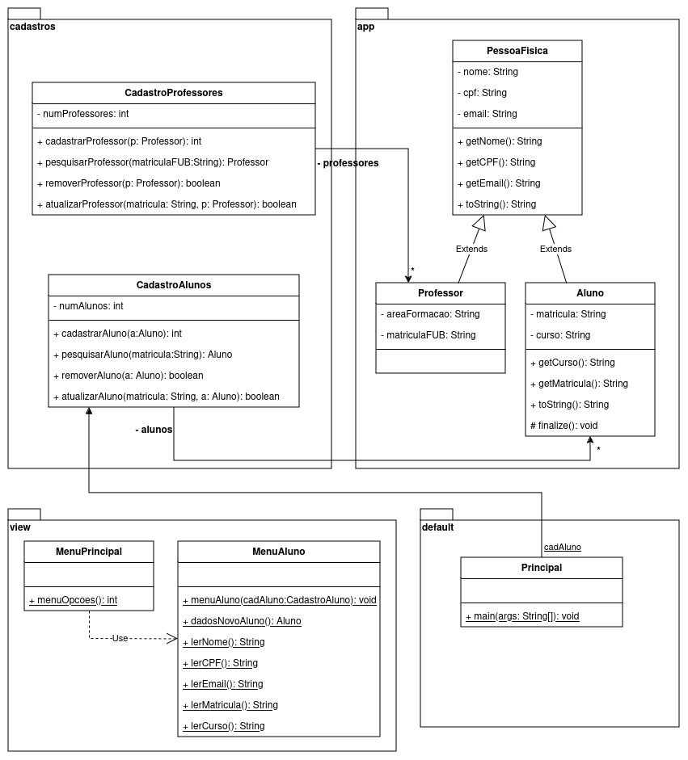

Lista 2  
Atividade extra-classe e revisão para a avaliação 2
---

**Instruções:**  
Essa lista de exercícios cobre os seguintes tópicos de orientação por objetos,
vistos em sala de aula:  
  - Classes e Objetos 
  - Encapsulamento
  - Modificadores de acesso e de escopo
  - Herança
  - Polimorfismo
    - Sobrescrita de métodos
    - Sobrecarga de métodos
    - Inclusão
    - Coerção
  - Pacotes  

A lista de exercícios poderá ser feita em duplas. 

A resolução da lista deverá ser entregue ao professor até o dia da 2a.
avaliação. 

Referências bibliográficas: 
- Fundamentos do Desenho Orientado a Objetos  
  Meilir Page-Jones
- Utilizando UML e Padrões  
  Craig Larman

--- 

1 - Pesquise nas bibliografias sugeridas as definições sobre os seguinte termos:  
  a) Classe

    Um modelo que possui uma estrutura fixa composta por métodos (ou operações) e atributos é denominada de classe, conforme Jones Page. Segundo o autor, “uma classe é o estêncil a partir do qual são criados (gerados) objetos.” Dessa forma, os objetos gerados a partir dessa classe possuem a mesma estrutura e comportamento. Assim, caso um objeto pertença à determinada classe, diz-se que que esse objeto é uma instância dessa classe.
    
    De forma exemplificada, existe uma estrutura que define um tipo de objeto. Por exemplo, uma casa sempre terá paredes, portas e janelas e esses parâmetros definem uma casa. Porém, o tipo de parede, portas ou janelas muda conforme a casa. A essas características de uma casa se atribui o nome de atributos. Além disso, cada casa possui um tipo de parede, porta ou janelas.
    
    Porém, há diferenças entre objetos criados a partir da mesma classe. Primeiramente, cada objeto possui um identificador único; além de contar com estados distintos em relação a outros objetos. Em relação ao exemplo dado acima, cada casa possui um tipo de parede, porta ou janelas.

  
  b) Objeto

    O conceito de objeto pretende, principalmente, delinear a definição de uma instância de uma classe. Portanto, a partir de uma classe, que possui uma estrutura, comportamento e atributos, um objeto é uma instância que possui estados para cada atributo e que pode se comportar conforme está definido na classe.

  c) Elementos de classe

  	Uma classe é composta por grandes grupos como atributos e métodos (ou operações). Apesar dessa generalização, o autor Jones Meiler Page identifica mais um elemento que seria responsável pelas exceções ou invariantes.

    - Atributos:

	  Atributos representam informações de um objeto, porém, o termo não pode ser confundido com variável. Para diferenciar as semânticas entre os termos, utiliza-se a diferenciação entre concretude e abstração: uma variável corresponde a um parâmetro concreto, enquanto um atributo reside no campo abstrato. Em orientação a objetos, todas variáveis são atributos mas nem todo atributo é uma variável.
    
    - Métodos (ou operações):

    Métodos são estruturas pelas quais os atributos são utilizados. Ao serem definidos, há uma indicação de qual ou quais argumentos são necessários e se houver saída, o método indica qual é o tipo desse dado. Conforme Jones Meiler Page, um atributo típico requer duas operações padrões: obter (get)  (método que possibilita o acesso do estado de um atributo) e especificar (set) (métodos que permitem a modificação de um estado de um atributo).

  d) Métodos construtores
  
    Além de métodos que acessam ou modificam estados de atributos, há métodos responsáveis para criar instâncias de uma classe. Dessa forma, o autor Booch define métodos construtores como operadores que inicializam um objeto e/ou seus estados.
  
  e) Métodos destrutores

    Em contrapartida aos métodos construtores, existem métodos cuja função é liberar os estados de atributos de um objeto e/ou destroem um objeto em si.Ou seja, é um método para limpeza e liberação de recursos.

  f) Estado

    Estados se referem à combinação de todos atributos de um objeto, sejam estáticos, sejam dinâmicos; e os valores atuais desses atributos. 

  g) Retenção de estado
    
    Retenção de estado é a capacidade de um objeto de manter os estados atuais de seus atributos, mesmo que os métodos que tenham inicializado, acessado ou modificado determinado atributo tenha sido finalizado.

  h) Associação entre objetos

    Uma associação é uma forma semântica a partir da qual duas classes podem interagir. Em uma associação, pode haver a construção de novos métodos e atributos, de forma que esses elementos estejam em uma classe de associação.

    Destrinchar essa parte de associações. Listar os tipos de associações e definir seus conceitos
  
  i) Pacotes

    O autor Jones Page define o termo como uma coleção de classes em uma biblioteca adquirida. Existe para uma particular aplicação. Em relação à hierarquia, um pacote pode estar contido em outro. 

    [VERIFICAR SE O CONCEITO É ESSE MESMO]

  j) Modificadores de acesso
  Cada propriedade de uma classe conta com um prefixo, seja antes do nome do atributo ou do método, para que se indique a visibilidade da propriedade. Há quatro possibilidades, cada qual com um nível de privacidade.

      '+': atributos ou métodos públicos em uma determinada classe
        Assim, determinada propriedade (pública) será visível para qualquer objeto e essa propriedade será herdada pelas suas subclasses

      '#': atributos ou métodos protegidos em uma determinada classe
        Assim, determinada propriedade será visível para os objetos da mesma classe para os objetos das subclasses, de forma que esta propriedade será herdada pelas subclasses

      '-': atributos ou métodos privados
        Assim, a propriedade só será visível para o objeto em si. Não há herança para subclasses

  k) Ocultação de informação O conceito de ocultação de informação é englobado por um conceito maior que é o encapsulamento. O encapsulamento, conforme Jones Page, é um controle acerca de informações que estão contidas em objetos e atributos. Dividi-se em exterior e interior. 

  A ocultação de informações implica em ocultação de informações e de implementações, ou seja, atributos e métodos. Assim, a visualização de propriedades de uma classe ficam limitadas à sua estrutura de encapsulamento.

  l) Escopo de elementos Refere-se à visibilidade e acessibilidade de variáveis, métodos e outros quaisquer membros de um classe, portanto, não se restringindo a atributos ou métodos. Para definir a visibilidade desses elementos, há níveis de acesso.

    1. Público (public): elementos com esse escopo são acessíveis em qualquer parte do programa. E podem ser usados por qualquer outra clase.

    2. Protegido (protected): elementos com esse escopo são acessíveis apenas dentro da própria classe e nas suas subclasses (mesmo que estejam em pacotes diferentes) e por outras classes dentro do mesmo pacote.

    3. Pacote (package-private or default): elementos com esse escopo são acessíveis apenas dentro do mesmo pacote.

    4. Privado (private): elementos com esse escopo são acessíveis apenas dentro da própria classe. Eles não podem ser acessados por nenhuma outra classe ou código, mesmo que sejam subclasses.

  m) Modificadores de escopo Para definir a visibilidade e acessibilidade de cada elemento, utiliza-se palavras-chave de classes, métodos e variáveis. 

    1. Público (public): elemento acessível de qualquer lugar, tanto dentro do mesmo pacote quando de outros.

    2. Protegido (protected): elemento acessível apenas dentro do mesmo pacote e subclasses (neste caso, podem estar em diferentes pacotes).

    3. Default (sem modificador): neste caso, o elemento se torna acessível apenas dentro do mesmo pacote. 

    4. Privado (private): elementos são apenas acessados dentro da própria classe onde foi definido.

  n) Herança A herança é a habilidade de uma classe implicitamente ter seus atributos e métodos definidos a partir de uma outra classe, porém, como se tivessem sido implementados na sua classe. Assim, a classe A, que herda elementos de B, é chamada de subclasse de B e B é a superclasse de A.

  o) Generalização
     É o processo utilizado para organizar e estruturar classes de forma hierárquica. Generalização envolve uma estrutura comum abstrata para uma ou várias classes que podem ser herdadas.

  p) Especialização
    Especialização é o processo inverno no qual classes mais específicas, dependendo dos casos, são criadas levando em conta tanto a estrutura da superclasse quanto as necessidades específicas daquela classe.

  q) Polimorfismo
    O autor Jones Mieler Page utiliza duas definições para o termo polimorfismo. 
    
        A primeira delas é "a habilidade pela qual uma única operação ou nome de atributo pode ser definido em mais de uma classe e assumir implementações diferentes ...".
      
        Em sua segunda definição, o autor explicita que polimorfismo é a propriedade por meio da qual um atributo ou variável pode paontar para (ou manter o identificador de) objetos de diferentes classes em momentos diferentes. 

  r) Sobrescrita de métodos
  
      Também chamado de overriding, é a redefinição de um método, definido em uma classe A, e em uma das subclasses de A. Assim, os métodos são existentes tanto na classe quanto na sua superclasse. E, dessa forma, os métodos nas subclasses são definidos localmente.

  s) Sobrecarga de métodos
    
     Também chamado de overloading de um nome ou de um símbolo ocorre quando diversos métodos, definidos na mesma classe, tem esse nome ou símbolo. Por exempplo, no caso de métodos construtores alternativo e padrão.

  t) Polimorfismo por coerção

    Esse processo ocorre quando um valor é convertido de um tipo para outro automaticamente pelo próprio compilador.

  u) Polimorfismo por inclusão

    Esse processo ocorre quando uma classe derivada é usada no lugar da classe base. A classe derivada herda os métodos e propriedades da classe base, permitindo que se use instâncias da classe derivada onde a classe base é esperada.

  v) Polimorfismo paramétrico
    
     Esse processo ocorre quando um método ou classe pode operar sobre diferentes tipos de dados sem conhecer de antemão os tipos específicos. 

2 - Apresente os modificadores de acesso informando qual o nível de visibilidade
que cada um deles fornece. 

3 - Qual a forma de comunicação empregada no paradigma de Orientação por
Objetos?

4 - A quem pertence um elemento cujo escopo é dinâmico?  

5 - Se dois ou mais objetos possuem o mesmo estado, significa que eles são o
mesmo objeto? Justifique sua resposta. 

6 - Quais objetos uma referência de uma classe consegue referenciar? 

7 - Uma referência de uma subclasse pode referenciar um objeto de alguma
superclasse? Justifique sua resposta.

8 - Elementos privados de uma superclasse são herdados e acessíveis por suas
subclasses?  

9 - Considere a seguinte descrição: uma classe A possui 2 atributos e 3 métodos,
uma classe B (herdeira de A) possui outros 2 atributos e 3 métodos. Uma
referência do tipo A referencia um objeto do tipo B. Quantos atributos e métodos
estão disponíveis para a referência A? 

10 - Considerando um conjunto de classes hierarquicamente dispostas, qual é a
vantagem de se utilizar uma referência da superclasse mais alta nessa
hierarquia?

--- 

Considere o seguinte diagrama de classes: 

Esse diagrama de classes está parcialmente implementado no diretório desse
exercício. O código é compilável e executável. O arquivo .drawio desse diagrama
encontra-se no diretório dessa lista.  

Com base nesse diagrama responda as seguintes perguntas:  
1 - No diagrama de classes estão apresentados vários elementos sublinhados. O
que isso significa?  

2 - O que significam os nomes nas origens das setas fechadas entre classes? O
que significam os * na outra extremidade das setas? 

3 - O que significa a setas abertas presentes no pacote app? 

4 - O que significa a seta tracejada entre MenuPrincipal e MenuAluno? 

5 - Existe algum tipo de polimorfismo nesse diagrama? Se sim, qual? 

6 - Termine a implementação desse diagrama com a implementação do cadastro de
professores. Pode utilizar o cadastro de alunos como base. 
